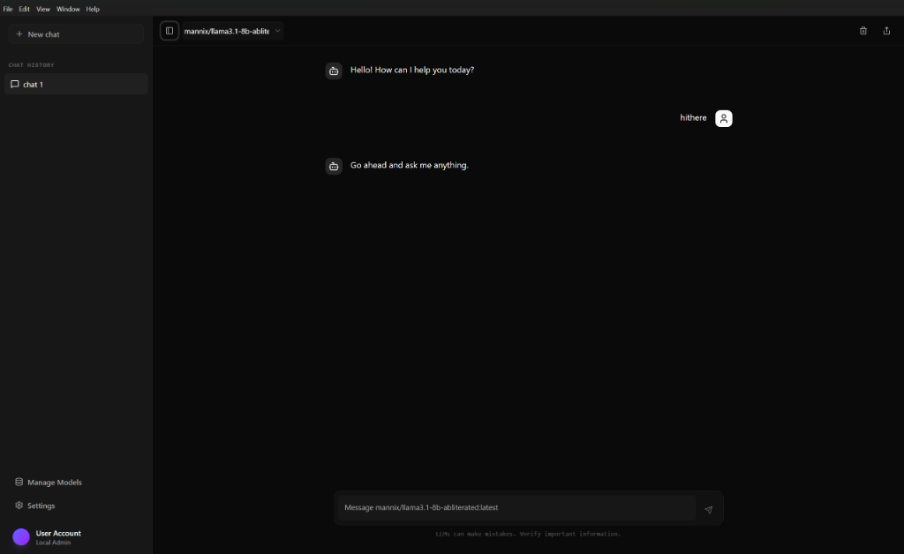

# Chat AI

A modern, desktop AI chat application built with Electron and React, designed specifically for seamless interaction with local AI models via Ollama.



## ✨ Features

- **🤖 Local AI First**: Deep integration with [Ollama](https://ollama.com/) for private, local inference.
- **🗣️ Voice Interaction**: Text-to-speech capabilities powered by **Kokoro JS** for a natural voice experience.
- **💬 Rich Chat Experience**: Full Markdown support, code highlighting, and smooth streaming responses.
- **🎨 Modern UI**: Beautiful, dark-themed interface built with **Tailwind CSS v4** and **Radix UI**.
- **📂 Session Management**: Easily organize and navigate through your chat history.
- **⚙️ Model Control**: Switch between different local models on the fly.

## 🚀 Tech Stack

- **[Electron](https://www.electronjs.org/)**: Cross-platform desktop runtime.
- **[Vite](https://vitejs.dev/)**: Lightning-fast build tool and bundler.
- **[React](https://react.dev/)**: For building interactive UIs.
- **[TypeScript](https://www.typescriptlang.org/)**: Application-scale JavaScript with types.
- **[Tailwind CSS v4](https://tailwindcss.com/)**: Utility-first CSS framework.
- **[Kokoro JS](https://github.com/kokoro-js/kokoro-js)**: High-quality AI voice synthesis.

## 🛠️ Getting Started

### Prerequisites

- [Node.js](https://nodejs.org/) (v18 or higher recommended)
- [Ollama](https://ollama.com/) running locally

### Installation

1.  Clone the repository:

    ```bash
    git clone https://github.com/Shruthikshetty/chat-ai.git
    cd chat-ai
    ```

2.  Install dependencies:

    ```bash
    npm install
    ```

3.  Start the application:
    ```bash
    npm start
    ```

### Building for Production

To create a distributable package for your OS:

```bash
npm run package
```

## 📦 Downloads

You can find the latest build artifacts in the GitHub Actions tab.

[View Latest Builds](https://github.com/Shruthikshetty/chat-ai/actions)

## 📝 License

MIT
